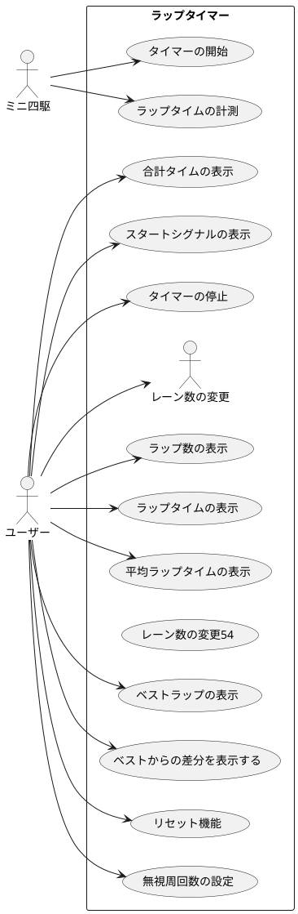

# 要件定義

## 要求一覧

ミニ四駆のラップタイマーの要求を提案します。

タイマーの開始と停止: ユーザーがタイマーを開始し、停止できるようにします。
ラップタイムの計測: ユーザーが各ラップのタイムを計測できるようにします。
ラップ数の表示: ユーザーが現在のラップ数を確認できるようにします。
ラップタイムの表示: ユーザーが各ラップのタイムを確認できるようにします。
ベストラップの表示: ユーザーが最速のラップタイムを確認できるようにします。
リセット機能: ユーザーがタイマーとラップタイムをリセットできるようにします。
複数レーンの測定: ユーザーが複数のレーンのタイムを計測できるようにします。
レーン数の変更: ユーザーがレーン数を2または3に変更できるようにします。
無周回数の設定: ユーザーが無周回数を設定できるようにします。
合計タイムの測定: ユーザーが合計タイムを測定できるようにします。
どのレーンからでもスタートできる: ユーザーがどのレーンからでもスタートできるようにします。
スタートシグナルの表示: ユーザーがスタートシグナルを表示できるようにします。

以上がミニ四駆のラップタイマーの基本的な要求です。これらの要求を満たすために、適切なプログラムを作成する必要があります。

## ユースケース図

# UI定義

## メイン画面

## レーン数変更画面

## 無周回数設定画面

## ラップタイム表示画面

## ベストラップ表示画面

## 合計タイム表示画面

## ラップタイム計測画面

## ラップタイム計測画面(複数レーン)

## ラップタイム計測画面(無周回)

## ラップタイム計測画面(複数レーン, 無周回)

# プログラム設計

